<p align="center">
  
</p>

<p align="center">
  <strong>Mdcito — 移动端 Markdown 编辑器</strong>
</p>

<p align="center">
  
  
  
  
  
  
  
</p>

---

## 目录

- [产品简介](#产品简介)
- [产品截图](#产品截图)
- [功能特性](#功能特性)
  - [编辑器](#编辑器)
  - [文件管理](#文件管理)
  - [导出](#导出)
  - [云同步](#云同步)
  - [图床](#图床)
  - [主题系统](#主题系统)
  - [国际化](#国际化)
  - [其他功能](#其他功能)
- [技术栈](#技术栈)
- [项目结构](#项目结构)
- [构建与运行](#构建与运行)
- [编辑器快捷键](#编辑器快捷键)
- [许可证](#许可证)
- [打赏与支持](#打赏与支持)
- [联系与贡献](#联系与贡献)
- [致谢](#致谢)

---

## 产品简介

**Mdcito** 是一款面向 Android 平台的 Markdown 编辑器，采用 Kotlin + Jetpack Compose + Material 3 构建，支持 Android 14 及以上系统。

Mdcito 提供**双模式编辑体验**：在纯文本编辑模式下，你可以使用完整的格式化工具栏编写 Markdown 源码；切换到预览模式后，可以查看渲染后的文档效果。两种模式之间通过按钮一键切换，并支持编辑区与预览区的**同步滚动**。

文件存储采用**本地优先**策略，所有内容默认保存在设备本地，保障数据隐私与安全。同时提供可选的云同步能力，支持 WebDAV、FTP/SFTP、OneDrive、Google Drive 等主流协议。

在视觉层面，Mdcito 以**日式极简（Japandi）** 美学为基调，提供三种卡片风格、八套主题方案、自定义字体和背景图片，让编辑环境既专业又有个性。

**适用人群**：技术开发者（编写技术文档、README、API 文档）、内容创作者（博客、笔记）、学生和教育工作者（学习笔记、论文）、移动办公者（通勤途中的快速记录）。

---

## 产品截图

| | | |
|:---:|:---:|:---:|
|  | 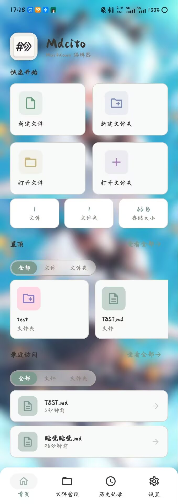 | 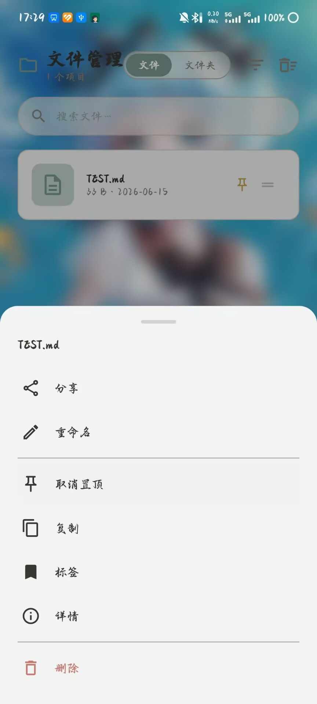 |
| 开场动画 | 首页 | 文件管理 |
| 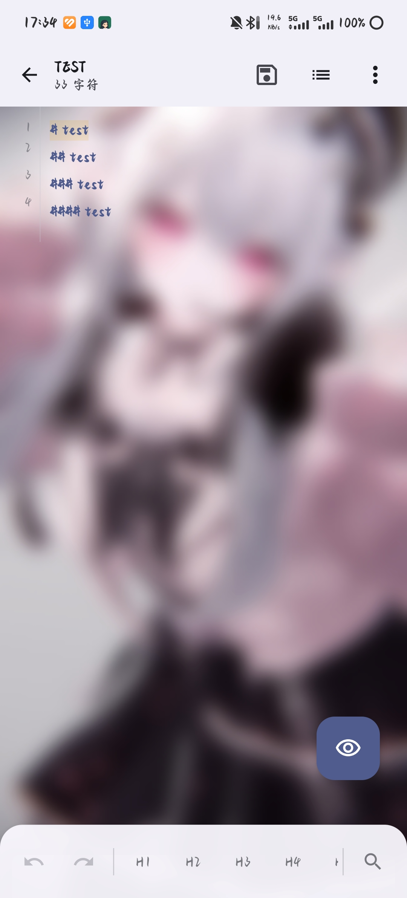 | 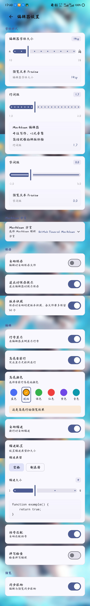 | 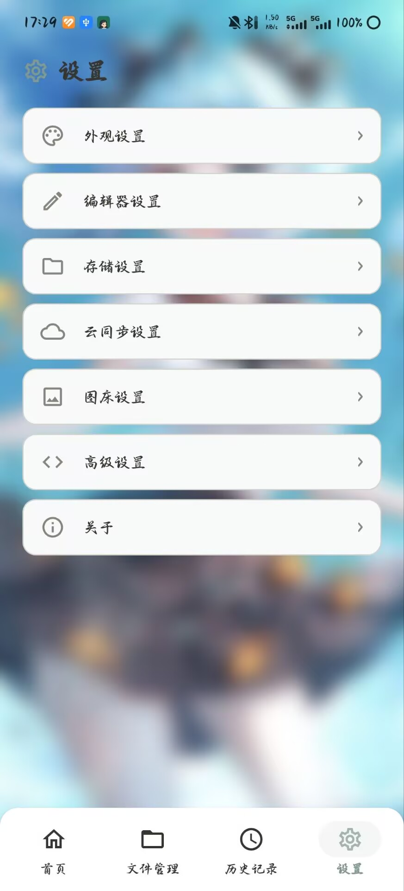 |
| 编辑器 | 编辑器设置 | 设置主页 |
| 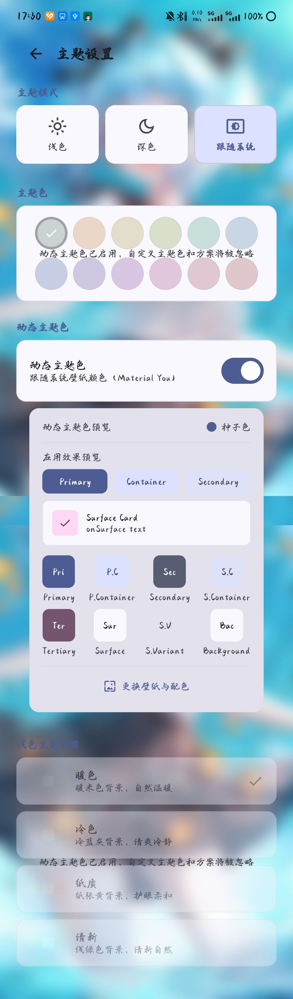 | 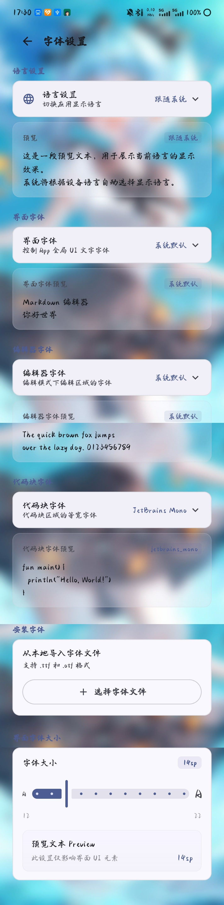 | 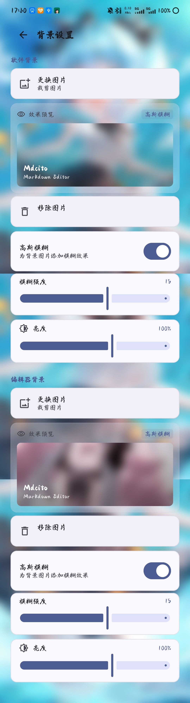 |
| 主题设置 | 字体设置 | 背景设置 |
| 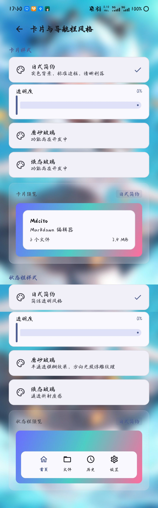 |  | 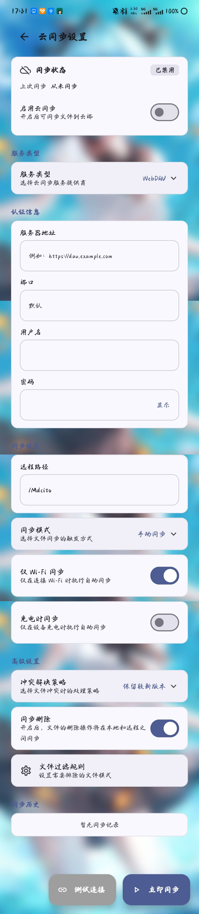 |
| 卡片与导航栏风格 | 存储设置 | 云同步设置 |
| 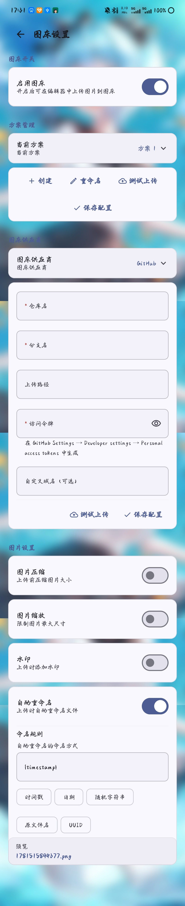 | 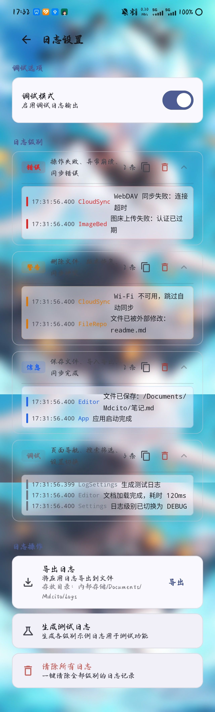 | 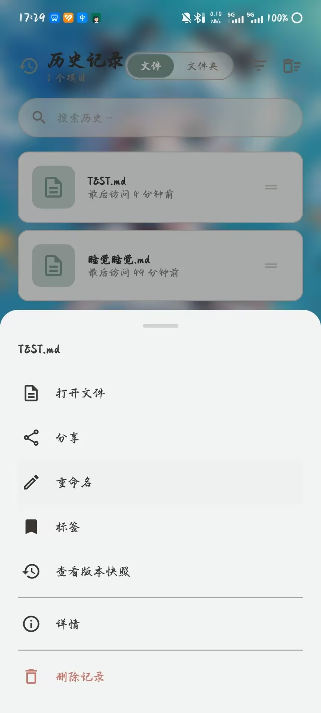 |
| 图床设置 | 日志设置 | 历史记录 |
| | 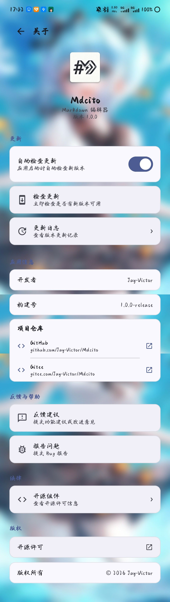 | |
| | 关于页面 | |

---

## 功能特性

### 编辑器

Mdcito 的核心是双模式编辑系统，通过顶栏按钮一键在两种模式间切换：

| 特性 | 说明 |
|------|------|
| **纯文本编辑模式** | 完整的 Markdown 源码编辑器，提供语法高亮、行号显示、当前行高亮、自动缩进和括号匹配 |
| **渲染预览模式** | 基于 WebView 的实时 HTML 渲染预览，支持本地图片加载，工具栏自动隐藏以最大化阅读空间 |
| **模式切换** | 通过顶栏按钮一键切换，保留编辑状态 |
| **同步滚动** | 编辑区和预览区双向同步滚动（可在设置中启用/禁用） |
| **沉浸模式** | 全屏预览，隐藏状态栏和导航栏，点击屏幕退出 |

#### 格式化工具栏（纯文本模式下显示）

工具栏包含 17 组格式化按钮，跟随键盘升降：

| 分组 | 按钮 | 功能 |
|------|------|------|
| 撤销/重做 | 撤销、重做 | 完整的撤销/重做历史栈 |
| 标题 | H1-H6 | 插入对应级别标题 |
| 文本样式 | 加粗、斜体、粗斜体、删除线 | 插入/包裹选中文本 |
| 列表 | 无序列表、有序列表、任务列表 | 在行首插入列表标记 |
| 引用与代码 | 引用块、行内代码、代码块 | 插入引用/代码标记 |
| 链接与图片 | 链接、图片 | 链接弹窗输入；图片支持本地相册和图床上传 |
| 其他 | 分割线、表格、行内公式 `$...$`、块级公式 `$$...$$`、搜索 | 表格提供可视化行列选择器弹窗 |

#### 编辑增强

| 特性 | 说明 |
|------|------|
| **语法高亮** | Markdown 语法元素着色（标题/粗体/斜体/代码/链接/引用/列表/表格/公式），颜色随主题联动 |
| **代码块高亮** | 预览模式下通过内嵌 highlight.js 实现 100+ 编程语言语法高亮 |
| **数学公式** | 内嵌 KaTeX 渲染引擎，支持行内 `$...$` 和块级 `$$...$$` LaTeX 数学公式 |
| **目录导航** | 右侧滑出侧边栏，显示文档标题层级结构（H1-H6），支持展开/折叠和点击跳转 |
| **拼写检查** | SymSpellKt 引擎（英文，1000+ 常用词词典）+ 中文常见错别字规则检测（的/地/得、在/再、即/既等 20+ 组），支持用户自定义词典，红色波浪下划线标注错误，点击弹出纠正建议弹窗 |
| **搜索与替换** | 全文搜索，支持大小写敏感、全词匹配、正则表达式，搜索历史记录 |
| **行号显示** | 可选行号列，当前行高亮（可自定义高亮颜色） |
| **自动缩进** | 换行自动继承上一行缩进，支持空格/制表符切换和缩进大小配置 |
| **括号匹配** | 代码块内自动匹配括号 |
| **自动保存** | 可配置保存间隔，后台自动保存，保存状态顶栏指示 |

#### 编辑器插入功能详述

| 功能 | 操作方式 |
|------|----------|
| **插入表格** | 工具栏点击表格按钮 → 弹出可视化行列选择器（1-20 行 × 1-10 列，实时网格预览）→ 确认后生成标准 Markdown 表格语法 |
| **插入图片** | 工具栏点击图片按钮 → 弹出底部操作表，提供三个选项：输入网络图片 URL、从本地相册选择、通过图床服务上传 |
| **插入链接** | 工具栏点击链接按钮 → 弹出模态框，输入链接文本和 URL |
| **插入代码块** | 工具栏点击代码块按钮 → 自动生成包裹代码块的 \`\`\` 标记 |

### 文件管理

Mdcito 提供完整的文件/文件夹管理体系，支持本地存储和外部导入：

| 特性 | 说明 |
|------|------|
| **基本操作** | 创建、重命名、删除、复制、移动、分享文件或文件夹 |
| **多级文件夹** | 支持嵌套文件夹结构，面包屑导航，点击文件夹卡片进入子页面 |
| **标签系统** | 为文件和文件夹添加自定义标签，支持按标签过滤列表 |
| **置顶功能** | 置顶常用文件和文件夹，首页置顶区快速访问 |
| **排序** | 按名称、修改时间、文件大小排序（升序/降序） |
| **过滤** | 按文件类型（.md/.txt/.markdown）、时间范围（今天/本周/本月/今年）、标签、置顶状态组合过滤 |
| **搜索** | 顶部搜索栏实时过滤当前列表 |
| **批量操作** | 多选模式（长按卡片进入），批量删除、批量添加标签 |
| **外部导入** | 支持导入外部 Markdown 文件：仅查看模式（不改动原文件）或导入到工作区 |
| **文件详情** | 查看文件名称、大小、路径、创建时间、修改时间等元信息 |
| **滑动操作** | 卡片左滑显示快捷删除，右滑显示快捷置顶 |

**首页功能**：

| 区域 | 内容 |
|------|------|
| 品牌展示区 | 应用 Logo + 产品名称 + 副标题 |
| 快速开始区 | 四个快捷操作卡片：新建文件、新建文件夹、打开文件、打开文件夹 |
| 统计信息 | 文件数量、文件夹数量、总存储大小（点击跳转对应列表） |
| 置顶区 | 置顶的文件和文件夹（条件显示，支持按文件/文件夹筛选） |
| 最近访问区 | 最近访问的 5 个项目，可跳转至完整历史列表 |

### 导出

编辑器内通过"更多"菜单 → "导出文件"触发，支持 5 种格式：

| 格式 | 扩展名 | 实现方式 |
|------|--------|----------|
| **Markdown** | .md | 原始 Markdown 源码直接写出 |
| **纯文本** | .txt | 去除 Markdown 标记的纯文本 |
| **HTML** | .html | 经 MarkdownRenderer 渲染为完整 HTML 页面，含内嵌 CSS 样式 |
| **PDF** | .pdf | WebView 加载渲染后的 HTML → PrintManager 生成矢量 PDF（A4 纸张，300 DPI），支持图片加载完成后才打印，所见即所得 |
| **DOCX** | .docx | Apache POI 逐段解析 Markdown 生成 Word 文档，完整支持标题层级、粗体/斜体/删除线、行内代码、链接、引用块、有序/无序列表、代码块（灰色背景）、分割线 |

### 云同步

通过设置页 → 存储设置 → 云同步进入配置页面：

| 协议 | 实现 | 说明 |
|------|------|------|
| **WebDAV** | `WebDavSyncProvider` | 兼容坚果云、Nextcloud 等，支持 HTTPS 加密 |
| **FTP** | `FtpSyncProvider` | 基于 Apache Commons Net |
| **FTPS** | `FtpSyncProvider` (TLS) | FTP over TLS，加密传输 |
| **SFTP** | `FtpSyncProvider` (SSH) | 基于 SSHj 的 SSH 文件传输 |
| **OneDrive** | `OneDriveSyncProvider` | OAuth2 授权，通过自定义 URL scheme 回调 |
| **Google Drive** | `GoogleDriveSyncProvider` | OAuth2 授权，通过自定义 URL scheme 回调 |

**同步特性**：

| 特性 | 说明 |
|------|------|
| 同步模式 | 手动同步 / 自动同步（定时触发，最小间隔 15 分钟） |
| 网络约束 | 仅 Wi-Fi 同步、充电时同步 |
| 冲突解决 | 保留较新版本 / 本地优先 / 远程优先 / 手动解决 |
| 文件过滤 | 支持通配符排除特定文件模式 |
| 同步状态 | 显示上次同步时间、同步进度、上传/下载/跳过/冲突计数 |
| 后台任务 | 基于 WorkManager 实现自动同步的定时调度 |

### 图床

通过设置页 → 图床设置进入配置页面，支持 7 种图床服务：

| 服务 | 配置字段 | 说明 |
|------|----------|------|
| **GitHub** | 仓库名、分支、Token、自定义域名 | 将图片上传至 GitHub 仓库 |
| **七牛云** | AccessKey、SecretKey、空间名、上传域名、存储区域 | 七牛云对象存储 Kodo |
| **阿里云 OSS** | AccessKeyId、AccessKeySecret、Bucket、Endpoint、Region | 阿里云对象存储 |
| **腾讯云 COS** | SecretId、SecretKey、Bucket、Region | 腾讯云对象存储 |
| **Imgur** | Client ID | Imgur 图片托管服务 |
| **SM.MS** | API Token | SM.MS 图床 |
| **自定义** | 接口地址、请求方式、请求头（JSON）、响应解析规则 | 自定义 API 接口 |

**图床功能特性**：

| 特性 | 说明 |
|------|------|
| 方案管理 | 支持创建多个配置方案，按名称区分，切换激活方案，导入/导出配置 |
| 连接测试 | 每个方案可单独测试连接，验证配置正确性 |
| 图片压缩 | 可配置压缩开关和质量（0-100） |
| 图片缩放 | 预设尺寸（HD/Full HD/2K/4K）或自定义最大宽高 |
| 水印 | 可配置水印文字、位置（9 个方位）、不透明度 |
| 自动重命名 | 支持时间戳、日期、随机字符串、UUID、原文件名等命名规则 |
| 保密字段 | 密码/Token 类字段使用 AndroidX Security Crypto 加密存储 |

### 主题系统

通过设置页 → 外观设置进入子页面：

| 设置项 | 可选项 | 说明 |
|--------|--------|------|
| **主题模式** | 跟随系统 / 浅色 / 深色 | 控制应用整体明暗 |
| **主题色** | 12 种颜色 | 应用强调色，影响按钮、图标、导航栏激活态等 |
| **Material You** | 开关 | Android 12+ 动态取色，跟随系统壁纸生成调色板 |
| **浅色方案** | 暖色 / 冷色 / 纸质 / 清新 | 浅色模式下的背景色调方案 |
| **深色方案** | 暖色深色 / 冷色深色 / OLED / 午夜 | 深色模式下的背景色调方案 |
| **卡片风格** | 日式简约 / 磨砂玻璃 / 液态玻璃 | 控制卡片视觉效果 |

**字体管理**（设置页 → 外观设置 → 字体设置）：

| 字体分类 | 说明 |
|----------|------|
| 界面字体 | 控制全局 UI 文字字体 |
| 编辑器字体 | 控制编辑模式下的代码字体 |
| 代码块字体 | 控制预览中代码块的等宽字体 |
| 内置字体 | 思源黑体（Noto Sans SC）、JetBrains Mono、霞鹜文楷（LXGW WenKai），支持在线下载安装 |
| 自定义字体 | 支持导入本地 .ttf/.otf 文件 |

**背景设置**（设置页 → 外观设置 → 背景设置）：

| 设置项 | 说明 |
|--------|------|
| 软件背景 | 全局背景图片（所有页面可见） |
| 编辑器背景 | 编辑器页面独立背景图片 |
| 高斯模糊 | 背景图片模糊效果开关和强度调节 |
| 亮度调节 | 背景图片亮度调节 |
| 卡片透明度 | 控制卡片背景透明度 |
| 导航栏透明度 | 控制底部导航栏透明度 |

### 国际化

通过设置页 → 外观设置 → 语言设置切换，切换后需重启应用生效。支持 7 种语言：

| 语言 | 语言代码 |
|------|----------|
| 简体中文 | zh-CN |
| 繁體中文 | zh-TW |
| English | en |
| 日本語 | ja |
| 한국어 | ko |
| Deutsch | de |
| Français | fr |

### 其他功能

| 功能 | 说明 |
|------|------|
| **版本快照** | 每次保存时自动创建版本快照，每文件最多保留 50 个；支持查看历史版本列表、版本内容预览、恢复到任意历史版本 |
| **OTA 更新** | GitHub + Gitee 双源并行检查更新，应用内下载 APK 并安装，支持 3 个 GitHub 镜像加速下载节点 |
| **日志系统** | Error/Warn/Info/Debug 四级日志，基于 Timber；调试模式下可查看各级别日志内容，支持导出日志文件、生成测试日志 |
| **触觉反馈** | 部分操作提供振动反馈（HapticHelper） |
| **新手引导** | 首次启动显示引导页，介绍核心功能；文件权限未授予时引导授权 |
| **开场动画** | 启动时显示品牌 Logo 动画（无障碍"减少动画"设置开启时跳过） |
| **响应式布局** | 适配小屏手机（≤360dp）、标准手机（361-599dp）、平板竖屏（600-839dp）、平板横屏/折叠屏（≥840dp） |
| **GPU 加速** | 可在高级设置中切换硬件加速渲染开关 |

---

## 技术栈

| 类别 | 技术 | 版本 |
|------|------|------|
| 语言 | Kotlin | 2.3.0 |
| UI 框架 | Jetpack Compose (BOM) + Material 3 | 2026.05.00 |
| 构建 | Gradle + KSP | 8.10.1 |
| 依赖注入 | Hilt（含 Hilt Navigation Compose + Hilt Work） | 2.58 |
| 数据库 | Room（FileEntity / HistoryEntity / VersionEntity） | 2.8.4 |
| 键值存储 | DataStore Preferences（设置）+ 加密 DataStore（敏感字段） | 1.1.1 |
| 导航 | Navigation Compose | 2.9.8 |
| 图片加载 | Coil 3 (Compose + OkHttp Network) | 3.4.0 |
| Markdown 解析 | CommonMark (core + ext-gfm-tables/strikethrough/heading-anchor/task-list-items/autolink) + JetBrains Markdown | 0.28.0 / 0.7.3 |
| 拼写检查 | SymSpellKt (android) | 2.1.0 |
| DOCX 导出 | Apache POI (poi-ooxml) | 5.5.1 |
| 网络 | OkHttp | 4.12.0 |
| FTP | Apache Commons Net | 3.11.1 |
| SFTP | SSHj | 0.39.0 |
| 数学渲染 | KaTeX（内嵌 raw 资源，PDF 导出时内联注入） | 0.16.11 |
| 代码高亮 | highlight.js（内嵌 assets，PDF 导出时内联注入） | 11.9.0 |
| 后台任务 | WorkManager | 2.10.0 |
| 图片裁剪 | Android Image Cropper | 4.7.0 |
| 日志 | Timber | 5.0.1 |
| JSON | Gson | 2.13.1 |
| 安全加密 | AndroidX Security Crypto | 1.1.0-alpha06 |
| AndroidX | AppCompat, Activity Compose, Core KTX, SplashScreen, Browser, DocumentFile | — |

---

## 项目结构

```
Mdcito/
├── app/
│   ├── src/main/java/com/mdcito/app/
│   │   ├── data/                        # 数据层
│   │   │   ├── datastore/               # DataStore 存储（设置 / 加密凭据）
│   │   │   │   ├── SettingsDataStore.kt    # 通用设置 Key-Value 存储
│   │   │   │   └── SecureSettingsDataStore.kt  # 加密 Key-Value 存储（密码/Token）
│   │   │   ├── db/                      # Room 数据库层
│   │   │   │   ├── MdcitoDatabase.kt    # 数据库定义（版本 6，含 5 次迁移）
│   │   │   │   ├── dao/                 # FileDao / HistoryDao / VersionDao
│   │   │   │   ├── entity/              # FileEntity / HistoryEntity / VersionEntity
│   │   │   │   └── converter/           # 类型转换器
│   │   │   ├── files/                   # SAF 文件操作（创建/删除/重命名/读取/写入）
│   │   │   ├── font/                    # 字体服务（下载/安装/缓存）
│   │   │   ├── image/                   # 图床上传 + 图片处理（压缩/缩放/水印）
│   │   │   │   ├── ImageUploadService.kt  # 策略模式的分发服务（7 种提供商）
│   │   │   │   └── ImageProcessor.kt      # 图片压缩/缩放/水印处理
│   │   │   ├── locale/                  # 多语言（LanguageHelper 运行时切换）
│   │   │   ├── log/                     # 日志系统（Timber + 文件日志树）
│   │   │   ├── model/                   # 数据模型（ImageHostProfile 等）
│   │   │   ├── repository/              # Repository 层（File / History / Settings / Version）
│   │   │   ├── sync/                    # 云同步引擎
│   │   │   │   ├── CloudSyncManager.kt     # 同步协调器（互斥锁保护）
│   │   │   │   ├── CloudSyncConfig.kt      # 同步配置数据类
│   │   │   │   ├── CloudSyncWorker.kt      # WorkManager 后台同步 Worker
│   │   │   │   ├── CloudSyncProvider.kt    # Provider 接口
│   │   │   │   ├── WebDavSyncProvider.kt   # WebDAV 实现
│   │   │   │   ├── FtpSyncProvider.kt      # FTP/FTPS/SFTP 实现
│   │   │   │   ├── OneDriveSyncProvider.kt # OneDrive OAuth2 实现
│   │   │   │   └── GoogleDriveSyncProvider.kt # Google Drive OAuth2 实现
│   │   │   └── update/                  # OTA 更新
│   │   │       ├── UpdateChecker.kt     # 并行检查 GitHub + Gitee
│   │   │       ├── ApkDownloader.kt     # APK 下载（含镜像加速）
│   │   │       └── UpdateModels.kt      # 更新相关数据模型
│   │   ├── di/                          # Hilt 依赖注入模块
│   │   │   └── AppModule.kt             # Database / Repository / Service 注入
│   │   ├── markdown/                    # Markdown 处理
│   │   │   ├── MarkdownRenderer.kt      # 三种方言渲染（CommonMark/GFM/JetBrains）→ HTML
│   │   │   ├── PdfExporter.kt           # PDF 导出（WebView + PrintManager）
│   │   │   └── DocxExporter.kt          # DOCX 导出（Apache POI）
│   │   ├── ui/                          # UI 层
│   │   │   ├── components/              # 共享组件
│   │   │   │   ├── MdcitoScaffold.kt    # 主 Scaffold（HorizontalPager + 动画过渡）
│   │   │   │   ├── MdcitoBottomNavBar.kt  # 底部导航栏（4 Tab + 激活指示器）
│   │   │   │   ├── MdcitoCard.kt        # 卡片组件（3 种风格）
│   │   │   │   ├── MdcitoModals.kt      # 模态框/底部操作表/确认对话框
│   │   │   │   ├── MdcitoToast.kt       # Toast 消息组件
│   │   │   │   ├── MdcitoTransitions.kt # 共享页面过渡动画
│   │   │   │   ├── MdcitoSkeleton.kt    # 骨架屏组件
│   │   │   │   ├── BackgroundImage.kt   # 背景图片组件
│   │   │   │   ├── BackgroundAdjustModal.kt # 背景调整模态框
│   │   │   │   └── SplashAnimation.kt   # 启动动画
│   │   │   ├── editor/                  # 编辑器
│   │   │   │   ├── EditorScreen.kt      # 编辑器主页面（模式切换/导出/搜索/目录/表格弹窗）
│   │   │   │   ├── EditorViewModel.kt   # 编辑器 ViewModel
│   │   │   │   ├── EditorToolbar.kt     # 格式化工具栏（17 组按钮）
│   │   │   │   ├── MarkdownPreview.kt   # WebView 渲染预览
│   │   │   │   ├── MarkdownSyntaxHighlighter.kt # Markdown 语法着色
│   │   │   │   ├── EditorSearchModal.kt # 搜索替换模态框
│   │   │   │   ├── SpellCheckerService.kt # 拼写检查引擎
│   │   │   │   ├── TableOfContentsSidebar.kt # 目录侧边栏
│   │   │   │   ├── VersionHistoryScreen.kt # 版本历史页面
│   │   │   │   └── VersionHistoryViewModel.kt
│   │   │   ├── files/                   # 文件管理页面
│   │   │   ├── history/                 # 历史记录页面
│   │   │   ├── home/                    # 首页
│   │   │   ├── navigation/              # 导航
│   │   │   │   ├── Route.kt             # 所有页面路由定义（24 个路由）
│   │   │   │   └── MdcitoNavGraph.kt    # NavHost 导航图（含页面过渡动画）
│   │   │   ├── onboarding/              # 新手引导
│   │   │   ├── settings/                # 设置页面（15 个子页面）
│   │   │   │   ├── SettingsScreen.kt    # 设置主页
│   │   │   │   ├── SettingsViewModel.kt # 设置 ViewModel
│   │   │   │   ├── AppearanceSettingsScreen.kt
│   │   │   │   ├── ThemeSettingsScreen.kt
│   │   │   │   ├── FontSettingsScreen.kt
│   │   │   │   ├── BackgroundSettingsScreen.kt
│   │   │   │   ├── CardStyleSettingsScreen.kt
│   │   │   │   ├── EditorSettingsScreen.kt
│   │   │   │   ├── StorageSettingsScreen.kt
│   │   │   │   ├── ImageHostSettingsScreen.kt
│   │   │   │   ├── ImageHostViewModel.kt
│   │   │   │   ├── AdvancedSettingsScreen.kt
│   │   │   │   ├── PerformanceSettingsScreen.kt
│   │   │   │   ├── LogSettingsScreen.kt
│   │   │   │   ├── AboutScreen.kt
│   │   │   │   ├── OpenSourceScreen.kt
│   │   │   │   ├── SettingsComponents.kt
│   │   │   │   └── cloudsync/           # 云同步设置子页面
│   │   │   └── theme/                   # 主题系统
│   │   │       ├── Color.kt             # 12 种主题色 + Material You 动态色
│   │   │       ├── Type.kt              # 字体排版定义
│   │   │       ├── Shape.kt             # 形状定义
│   │   │       └── Theme.kt             # MdcitoTheme（主题色/方案/深色模式组合）
│   │   └── util/                        # 工具类
│   │       └── HapticHelper.kt          # 触觉反馈
│   ├── src/main/res/                    # 资源（7 种语言字符串、颜色、图标、raw/KaTeX）
│   ├── src/main/assets/                 # highlight.min.js（代码高亮库）
│   └── build.gradle.kts                 # 应用模块构建脚本
├── gradle/
│   ├── libs.versions.toml               # 版本目录（统一管理依赖版本）
│   └── wrapper/                         # Gradle Wrapper
├── ic_launcher/                         # 应用图标 Play Store 素材
├── build.gradle.kts                     # 根项目构建脚本
├── settings.gradle.kts                  # 项目设置（module 声明）
└── LICENSE                              # AGPL-3.0 双协议许可证
```

---

## 构建与运行

### 环境要求

| 工具 | 版本要求 |
|------|----------|
| Android Studio | Hedgehog (2023.1.1) 或更高 |
| JDK | 17 或更高 |
| Android SDK | API Level 36 |
| Gradle | 8.10.1+（项目包含 Wrapper，无需手动安装） |
| 目标设备 | Android 14 (API 34) 及以上 |

### 构建步骤

```bash
# 1. 克隆仓库
git clone https://github.com/Jay-Victor/Mdcito.git
cd Mdcito

# 2. 使用 Android Studio 打开项目根目录，等待 Gradle 同步

# 3. Debug 模式安装运行
./gradlew installDebug

# 4. Release 模式构建（需先创建 keystore.properties 配置签名）
#    项目根目录创建 keystore.properties 文件：
#      storeFile=../mdcito-release.jks
#      storePassword=你的密钥库密码
#      keyAlias=你的密钥别名
#      keyPassword=你的密钥密码
./gradlew assembleRelease
```

### 权限说明

| 权限 | 用途 |
|------|------|
| `INTERNET` | 图床上传、云同步、更新检查、在线字体下载 |
| `MANAGE_EXTERNAL_STORAGE` | 文件管理（SAF 框架） |
| `VIBRATE` | 操作触觉反馈 |
| `POST_NOTIFICATIONS` | 更新版本通知 |
| `REQUEST_INSTALL_PACKAGES` | 应用内 APK 安装更新 |

---

## 编辑器快捷键

外接蓝牙/Type-C 键盘支持以下快捷键：

| 快捷键 | 功能 |
|--------|------|
| `Ctrl + N` | 新建文件 |
| `Ctrl + Shift + N` | 新建文件夹 |
| `Ctrl + O` | 打开文件 |
| `Ctrl + Shift + O` | 打开文件夹 |
| `Ctrl + S` | 保存 |
| `Ctrl + Z` | 撤销 |
| `Ctrl + Shift + Z` | 重做 |
| `Ctrl + F` | 搜索 |
| `Ctrl + H` | 替换 |
| `Ctrl + Shift + P` | 切换编辑/预览模式 |
| `Ctrl + B` | 加粗 |
| `Ctrl + I` | 斜体 |
| `F2` | 重命名 |
| `Delete` | 删除 |

---

## 许可证

Mdcito 采用**双协议授权**模式：

### 开源版本 — AGPL-3.0

适用于个人使用、学术研究、非商业目的。开源版本基于 [GNU AGPL-3.0](https://www.gnu.org/licenses/agpl-3.0.html) 许可：

- 可以自由查看、修改、分发源代码
- 修改后的代码必须以相同协议开源
- 通过网络提供服务也需公开修改后的源代码
- 必须保留原作者署名 "Jay-Victor"

完整条款详见仓库内的 [LICENSE](LICENSE) 文件。

### 商业版本 — 商业授权

如需闭源使用或将 Mdcito 用于商业目的，请购买商业授权。定价方案详见 [LICENSE](LICENSE) 文件。

**商业授权咨询**：QQ 1061037299 / 18261738221@163.com

---

## 打赏与支持

如果 Mdcito 对你有帮助，欢迎打赏支持开发者的持续维护和改进。

<p align="center">
  <table>
    <tr>
      <td align="center" width="50%">
        <strong>微信支付</strong>
        <br />
        
      </td>
      <td align="center" width="50%">
        <strong>支付宝</strong>
        <br />
        
      </td>
    </tr>
  </table>
</p>

---

## 联系与贡献

| 项目 | 链接/信息 |
|------|-----------|
| 作者 | Jay-Victor |
| 仓库 | [https://github.com/Jay-Victor/Mdcito](https://github.com/Jay-Victor/Mdcito) |
| 问题反馈 | [GitHub Issues](https://github.com/Jay-Victor/Mdcito/issues) |
| QQ | 1061037299 |
| QQ 交流群 | 952638024 |
| 邮箱 | 18261738221@163.com |

欢迎通过 Issues 提交 Bug 报告和功能建议，也欢迎 Fork 项目并提交 Pull Request。

---

## 致谢

Mdcito 的开发受益于以下开源项目：

| 项目 | 用途 | 许可证 |
|------|------|--------|
| [Jetpack Compose](https://developer.android.com/jetpack/compose) | 现代化 Android UI 框架 | Apache 2.0 |
| [CommonMark](https://commonmark.org/) | Markdown 解析引擎 | BSD 2-Clause |
| [JetBrains Markdown](https://github.com/JetBrains/markdown) | JetBrains Markdown 解析器 | Apache 2.0 |
| [KaTeX](https://katex.org/) | LaTeX 数学公式渲染 | MIT |
| [highlight.js](https://highlightjs.org/) | 代码语法高亮 | BSD 3-Clause |
| [SymSpellKt](https://github.com/DarkRoland/SymSpellKt) | 拼写检查引擎 | MIT |
| [Apache POI](https://poi.apache.org/) | DOCX 文档生成 | Apache 2.0 |
| [Coil](https://coil-kt.github.io/coil/) | Kotlin 图片加载库 | Apache 2.0 |
| [Hilt](https://dagger.dev/hilt/) | 依赖注入框架 | Apache 2.0 |
| [Room](https://developer.android.com/training/data-storage/room) | 本地数据库 | Apache 2.0 |
| [SQLDelight](https://cashapp.github.io/sqldelight/) (inspiration) | — | Apache 2.0 |
| [OkHttp](https://square.github.io/okhttp/) | HTTP 网络请求 | Apache 2.0 |
| [Timber](https://github.com/JakeWharton/timber) | 日志框架 | Apache 2.0 |
| [Android Image Cropper](https://github.com/CanHub/Android-Image-Cropper) | 图片裁剪 | Apache 2.0 |
| [Apache Commons Net](https://commons.apache.org/net/) | FTP 客户端 | Apache 2.0 |
| [SSHj](https://github.com/hierynomus/sshj) | SSH/SFTP 客户端 | Apache 2.0 |

完整开源组件列表（含版本号和许可证）请查看应用内「设置 → 关于 → 开源组件」页面。

---

<br>

---

<br>

<p align="center">
  
</p>

<p align="center">
  <strong>Mdcito — Mobile Markdown Editor</strong>
</p>

<p align="center">
  
  
  
  
  
  
  
</p>

---

## Table of Contents

- [Overview](#overview)
- [Screenshots](#screenshots)
- [Features](#features)
  - [Editor](#editor)
  - [File Management](#file-management)
  - [Export](#export)
  - [Cloud Sync](#cloud-sync)
  - [Image Hosting](#image-hosting)
  - [Theme System](#theme-system)
  - [Internationalization](#internationalization)
  - [Other Features](#other-features)
- [Tech Stack](#tech-stack)
- [Project Structure](#project-structure)
- [Build & Run](#build--run)
- [Keyboard Shortcuts](#keyboard-shortcuts)
- [License](#license)
- [Sponsor & Support](#sponsor--support)
- [Contact & Contributing](#contact--contributing)
- [Acknowledgments](#acknowledgments)

---

## Overview

**Mdcito** is a Markdown editor for Android, built with Kotlin, Jetpack Compose, and Material 3. It requires Android 14+.

Mdcito offers a **dual-mode editing experience**: use the full formatting toolbar to write Markdown source code in plain text mode, then switch to preview mode to see the rendered result. Toggle between modes with a single button tap, with optional **synchronized scrolling** between the editor and preview.

Files are stored **locally by default**, ensuring privacy and data security. Optional cloud sync supports WebDAV, FTP/SFTP, OneDrive, and Google Drive.

Visually, Mdcito follows **Japanese minimalist (Japandi)** aesthetics, offering three card styles, eight theme schemes, custom fonts, and background images for a professional yet personalized editing environment.

**Target users**: Developers (technical docs, READMEs, API docs), content creators (blogs, notes), students and educators (study notes, papers), and mobile workers (quick note-taking during commutes).

---

## Screenshots

| | | |
|:---:|:---:|:---:|
|  |  |  |
| Splash | Home | File Management |
|  |  |  |
| Editor | Editor Settings | Settings |
|  |  |  |
| Theme | Font | Background |
|  |  |  |
| Card Style | Storage | Cloud Sync |
|  |  |  |
| Image Hosting | Logs | History |
| |  | |
| | About | |

---

## Features

### Editor

Mdcito's core is a dual-mode editing system. Toggle between modes with a single button in the top bar:

| Feature | Description |
|---------|-------------|
| **Plain Text Mode** | Full Markdown source editor with syntax highlighting, line numbers, current line highlighting, auto-indent, and bracket matching |
| **Rendered Preview Mode** | WebView-based live HTML preview with local image support; toolbar auto-hides for maximum reading space |
| **Mode Toggle** | One-tap switch via top bar button, preserves editing state |
| **Synchronized Scrolling** | Bidirectional scroll sync between editor and preview (configurable in settings) |
| **Immersive Mode** | Full-screen preview, hides status bar and navigation bar; tap to exit |

#### Formatting Toolbar (visible in plain text mode)

17 formatting button groups that follow the keyboard:

| Group | Buttons | Function |
|-------|---------|----------|
| Undo/Redo | Undo, Redo | Full undo/redo history stack |
| Headings | H1-H6 | Insert heading markers |
| Text Styles | Bold, Italic, Bold-Italic, Strikethrough | Wrap selected text |
| Lists | Unordered, Ordered, Task List | Insert list markers at line start |
| Quote & Code | Blockquote, Inline Code, Code Block | Insert quote/code markers |
| Link & Image | Link, Image | Link via dialog; image from URL, gallery, or image hosting |
| Other | Horizontal Rule, Table, Inline Math `$...$`, Block Math `$$...$$`, Search | Table offers visual row/column selector dialog |

#### Editing Enhancements

| Feature | Description |
|---------|-------------|
| **Syntax Highlighting** | Markdown element coloring (headings, bold, italic, code, links, blockquotes, lists, tables, math); colors linked to theme |
| **Code Block Highlighting** | 100+ language syntax highlighting via bundled highlight.js in preview mode |
| **Math Formulas** | Bundled KaTeX engine for inline `$...$` and block `$$...$$` LaTeX rendering |
| **Table of Contents** | Slide-out sidebar showing heading hierarchy (H1-H6) with expand/collapse and tap-to-jump |
| **Spell Checking** | SymSpellKt engine (English, 1000+ word dictionary) + Chinese rule-based detection (20+ confusing character pairs like 的/地/得); custom user dictionary; red wavy underlines with correction suggestions on tap |
| **Search & Replace** | Full-text search with case-sensitive, whole-word, regex support; search history |
| **Line Numbers** | Optional line number column; current line highlighting with configurable color |
| **Auto-Indent** | Smart indentation inheritance on new lines; space/tab toggle with configurable indent size |
| **Bracket Matching** | Automatic bracket matching within code blocks |
| **Auto-Save** | Configurable save interval; background auto-save; save state indicator in top bar |

#### Insertion Features

| Feature | How It Works |
|---------|-------------|
| **Insert Table** | Toolbar button → visual row/column picker dialog (1-20 rows × 1-10 cols, real-time grid preview) → generates standard Markdown table syntax |
| **Insert Image** | Toolbar button → bottom sheet with three options: enter image URL, pick from local gallery, upload via image hosting service |
| **Insert Link** | Toolbar button → modal dialog for link text and URL |
| **Insert Code Block** | Toolbar button → auto-generates \`\`\` fencing markers |

### File Management

Full file and folder management with local storage and external import support:

| Feature | Description |
|---------|-------------|
| **CRUD** | Create, rename, delete, copy, move, share files and folders |
| **Multi-level Folders** | Nested folder structure with breadcrumb navigation |
| **Tags** | Custom tags for files and folders; tag-based filtering |
| **Pin** | Pin frequently used items for quick access on the home screen |
| **Sort** | By name, modification time, or file size (ascending/descending) |
| **Filter** | By file type (.md/.txt/.markdown), time range (today/week/month/year), tags, pin status |
| **Search** | Real-time search bar filtering the current list |
| **Batch Operations** | Multi-select mode (long-press to enter), batch delete, batch tag |
| **Import** | Import external Markdown files: view-only mode (preserves original) or import to workspace |
| **File Info** | View name, size, path, creation date, modification date |
| **Swipe Actions** | Swipe left: quick delete; swipe right: quick pin |

**Home Screen**:

| Section | Content |
|---------|---------|
| Brand Area | App logo + product name + subtitle |
| Quick Actions | Four action cards: New File, New Folder, Open File, Open Folder |
| Statistics | File count, folder count, total storage size (tap to jump to list) |
| Pinned | Pinned files and folders (conditional, filterable) |
| Recent | 5 most recently accessed items with link to full history |

### Export

Accessible from the editor's "More" menu → "Export File". 5 formats supported:

| Format | Extension | Implementation |
|--------|-----------|----------------|
| **Markdown** | .md | Raw source written directly |
| **Plain Text** | .txt | Content with Markdown syntax stripped |
| **HTML** | .html | Rendered via MarkdownRenderer into a full HTML page with inline CSS |
| **PDF** | .pdf | WebView loads rendered HTML → PrintManager generates vector PDF (A4, 300 DPI); waits for images to finish loading before printing for WYSIWYG output |
| **DOCX** | .docx | Apache POI parses Markdown line-by-line to generate Word document; supports heading levels, bold/italic/strikethrough, inline code, links, blockquotes, ordered/unordered lists, code blocks (gray background), horizontal rules |

### Cloud Sync

Accessible via Settings → Storage → Cloud Sync:

| Protocol | Implementation | Notes |
|----------|---------------|-------|
| **WebDAV** | `WebDavSyncProvider` | Nutstore, Nextcloud compatible; HTTPS encrypted |
| **FTP** | `FtpSyncProvider` | Via Apache Commons Net |
| **FTPS** | `FtpSyncProvider` (TLS) | FTP over TLS encryption |
| **SFTP** | `FtpSyncProvider` (SSH) | SSH file transfer via SSHj |
| **OneDrive** | `OneDriveSyncProvider` | OAuth2 authorization with custom URL scheme callback |
| **Google Drive** | `GoogleDriveSyncProvider` | OAuth2 authorization with custom URL scheme callback |

**Sync Features**:

| Feature | Description |
|---------|-------------|
| Sync Mode | Manual or automatic (periodic, minimum 15-minute intervals) |
| Network Constraints | Wi-Fi only, charging only |
| Conflict Resolution | Newer wins / local wins / remote wins / manual |
| File Filtering | Wildcard patterns to exclude specific files |
| Sync Status | Last sync time, progress, upload/download/skip/conflict counts |
| Background | WorkManager-based periodic scheduling for auto-sync |

### Image Hosting

Accessible via Settings → Image Hosting. 7 providers supported:

| Provider | Config Fields | Notes |
|----------|---------------|-------|
| **GitHub** | Repository, branch, token, custom domain | Upload images to GitHub repository |
| **Qiniu** | AccessKey, SecretKey, bucket, upload domain, region | Qiniu Kodo object storage |
| **Aliyun OSS** | AccessKeyId, AccessKeySecret, Bucket, Endpoint, Region | Alibaba Cloud OSS |
| **Tencent COS** | SecretId, SecretKey, Bucket, Region | Tencent Cloud COS |
| **Imgur** | Client ID | Imgur image hosting |
| **SM.MS** | API Token | SM.MS image hosting |
| **Custom** | Endpoint URL, HTTP method, headers (JSON), response parse rule | Custom API |

**Image Processing Features**:

| Feature | Description |
|---------|-------------|
| Profile Management | Multiple named profiles, export/import, activate/deactivate |
| Connection Test | Per-profile connection verification |
| Compression | Configurable toggle and quality (0-100) |
| Resizing | Preset sizes (HD/Full HD/2K/4K) or custom max dimensions |
| Watermark | Configurable text, position (9 locations), opacity |
| Auto-Rename | Timestamp, date, random string, UUID, original filename patterns |
| Secure Storage | Password/token fields encrypted via AndroidX Security Crypto |

### Theme System

Accessible via Settings → Appearance:

| Setting | Options | Description |
|---------|---------|-------------|
| **Theme Mode** | Follow System / Light / Dark | Controls overall light/dark |
| **Accent Color** | 12 colors | Affects buttons, icons, nav bar active state |
| **Material You** | Toggle | Android 12+ dynamic color from system wallpaper |
| **Light Schemes** | Warm / Cool / Paper / Fresh | Background tone for light mode |
| **Dark Schemes** | Warm Dark / Cool Dark / OLED / Midnight | Background tone for dark mode |
| **Card Style** | Minimal / Frosted Glass / Liquid Glass | Visual card effect |

**Fonts** (Settings → Appearance → Font):

| Category | Description |
|----------|-------------|
| UI Font | Controls global UI text font |
| Editor Font | Controls code font in editing mode |
| Code Font | Controls monospace font in preview code blocks |
| Built-in Fonts | Noto Sans SC, JetBrains Mono, LXGW WenKai (downloadable) |
| Custom Fonts | Import local .ttf/.otf files |

**Background** (Settings → Appearance → Background):

| Setting | Description |
|---------|-------------|
| App Background | Global background image (visible on all screens) |
| Editor Background | Editor-specific background image |
| Gaussian Blur | Toggle and intensity for background blur |
| Brightness | Background image brightness adjustment |
| Card Transparency | Card background opacity |
| Nav Bar Transparency | Bottom navigation bar opacity |

### Internationalization

Switch via Settings → Appearance → Language (app restart required). 7 languages:

| Language | Code |
|----------|------|
| 简体中文 | zh-CN |
| 繁體中文 | zh-TW |
| English | en |
| 日本語 | ja |
| 한국어 | ko |
| Deutsch | de |
| Français | fr |

### Other Features

| Feature | Description |
|---------|-------------|
| **Version Snapshots** | Auto-created on each save, up to 50 per file; view history list, preview content, restore to any version |
| **OTA Updates** | Parallel GitHub + Gitee release checks; in-app APK download and install; 3 GitHub mirror acceleration nodes |
| **Logging** | Four levels (Error/Warn/Info/Debug) via Timber; debug mode enables per-level log viewing; export logs, generate test logs |
| **Haptic Feedback** | Vibration feedback for certain actions (HapticHelper) |
| **Onboarding** | First-launch guide introducing core features; file permission authorization flow |
| **Splash Animation** | Brand logo animation on startup (skipped when system "Reduce Animations" accessibility setting is on) |
| **Responsive Layout** | Adapts to small phones (≤360dp), standard phones (361-599dp), portrait tablets (600-839dp), landscape tablets/foldables (≥840dp) |
| **GPU Acceleration** | Hardware-accelerated rendering toggle in advanced settings |

---

## Tech Stack

| Category | Technology | Version |
|----------|------------|---------|
| Language | Kotlin | 2.3.0 |
| UI Framework | Jetpack Compose (BOM) + Material 3 | 2026.05.00 |
| Build | Gradle + KSP | 8.10.1 |
| DI | Hilt (Hilt Nav Compose + Hilt Work) | 2.58 |
| Database | Room (FileEntity / HistoryEntity / VersionEntity) | 2.8.4 |
| Key-Value | DataStore Preferences + Encrypted DataStore | 1.1.1 |
| Navigation | Navigation Compose | 2.9.8 |
| Image Loading | Coil 3 (Compose + OkHttp Network) | 3.4.0 |
| Markdown Parsing | CommonMark (core + GFM extensions) + JetBrains Markdown | 0.28.0 / 0.7.3 |
| Spell Check | SymSpellKt (android) | 2.1.0 |
| DOCX Export | Apache POI (poi-ooxml) | 5.5.1 |
| Networking | OkHttp | 4.12.0 |
| FTP | Apache Commons Net | 3.11.1 |
| SFTP | SSHj | 0.39.0 |
| Math Rendering | KaTeX (bundled raw resource, inline-injected for PDF) | 0.16.11 |
| Code Highlight | highlight.js (bundled asset, inline-injected for PDF) | 11.9.0 |
| Background Tasks | WorkManager | 2.10.0 |
| Image Cropping | Android Image Cropper | 4.7.0 |
| Logging | Timber | 5.0.1 |
| JSON | Gson | 2.13.1 |
| Encryption | AndroidX Security Crypto | 1.1.0-alpha06 |
| AndroidX | AppCompat, Activity Compose, Core KTX, SplashScreen, Browser, DocumentFile | — |

---

## Project Structure

```
Mdcito/
├── app/
│   ├── src/main/java/com/mdcito/app/
│   │   ├── data/                        # Data layer
│   │   │   ├── datastore/               # DataStore (Settings / Secure credentials)
│   │   │   ├── db/                      # Room database (version 6, 5 migrations)
│   │   │   │   ├── MdcitoDatabase.kt
│   │   │   │   ├── dao/                 # FileDao / HistoryDao / VersionDao
│   │   │   │   ├── entity/              # FileEntity / HistoryEntity / VersionEntity
│   │   │   │   └── converter/           # Type converters
│   │   │   ├── files/                   # SAF file operations
│   │   │   ├── font/                    # Font service (download/install/cache)
│   │   │   ├── image/                   # Image hosting + processing
│   │   │   │   ├── ImageUploadService.kt  # Strategy pattern dispatcher
│   │   │   │   └── ImageProcessor.kt      # Compress/resize/watermark
│   │   │   ├── locale/                  # Runtime language switching
│   │   │   ├── log/                     # Timber + file log tree
│   │   │   ├── model/                   # Data models
│   │   │   ├── repository/              # File / History / Settings / Version repos
│   │   │   ├── sync/                    # Cloud sync engine
│   │   │   │   ├── CloudSyncManager.kt
│   │   │   │   ├── CloudSyncWorker.kt   # WorkManager periodic worker
│   │   │   │   ├── WebDavSyncProvider.kt
│   │   │   │   ├── FtpSyncProvider.kt   # FTP/FTPS/SFTP
│   │   │   │   ├── OneDriveSyncProvider.kt
│   │   │   │   └── GoogleDriveSyncProvider.kt
│   │   │   └── update/                  # OTA updates (GitHub + Gitee)
│   │   ├── di/                          # Hilt modules
│   │   ├── markdown/                    # Markdown rendering + export
│   │   │   ├── MarkdownRenderer.kt      # 3 dialects → HTML
│   │   │   ├── PdfExporter.kt           # WebView + PrintManager
│   │   │   └── DocxExporter.kt          # Apache POI
│   │   ├── ui/                          # UI layer
│   │   │   ├── components/              # Shared components (Scaffold, Card, NavBar, etc.)
│   │   │   ├── editor/                  # Editor (Screen, ViewModel, Toolbar, Preview, etc.)
│   │   │   ├── files/                   # File management
│   │   │   ├── history/                 # History
│   │   │   ├── home/                    # Home screen
│   │   │   ├── navigation/              # Routes (24) + NavGraph
│   │   │   ├── onboarding/              # Onboarding wizard
│   │   │   ├── settings/               # 15 settings sub-screens
│   │   │   └── theme/                   # Theme (Color, Type, Shape, Theme)
│   │   └── util/                        # Utilities (HapticHelper)
│   ├── src/main/res/                    # 7 locale strings, raw (KaTeX)
│   ├── src/main/assets/                 # highlight.min.js
│   └── build.gradle.kts
├── gradle/libs.versions.toml            # Version catalog
├── build.gradle.kts                     # Root build script
├── settings.gradle.kts                  # Module declaration
└── LICENSE                              # AGPL-3.0 dual license
```

---

## Build & Run

### Prerequisites

| Tool | Required |
|------|----------|
| Android Studio | Hedgehog (2023.1.1) or later |
| JDK | 17+ |
| Android SDK | API Level 36 |
| Gradle | 8.10.1+ (Wrapper included) |
| Target Device | Android 14 (API 34)+ |

### Steps

```bash
# 1. Clone
git clone https://github.com/Jay-Victor/Mdcito.git
cd Mdcito

# 2. Open in Android Studio, wait for Gradle sync

# 3. Debug install
./gradlew installDebug

# 4. Release build (requires keystore.properties in project root):
#      storeFile=../mdcito-release.jks
#      storePassword=your_keystore_password
#      keyAlias=your_key_alias
#      keyPassword=your_key_password
./gradlew assembleRelease
```

### Permissions

| Permission | Purpose |
|------------|---------|
| `INTERNET` | Image hosting, cloud sync, update checks, online font download |
| `MANAGE_EXTERNAL_STORAGE` | SAF-based file management |
| `VIBRATE` | Haptic feedback |
| `POST_NOTIFICATIONS` | Update notifications |
| `REQUEST_INSTALL_PACKAGES` | In-app APK installation for updates |

---

## Keyboard Shortcuts

Supported with external Bluetooth/USB-C keyboards:

| Shortcut | Action |
|----------|--------|
| `Ctrl + N` | New file |
| `Ctrl + Shift + N` | New folder |
| `Ctrl + O` | Open file |
| `Ctrl + Shift + O` | Open folder |
| `Ctrl + S` | Save |
| `Ctrl + Z` | Undo |
| `Ctrl + Shift + Z` | Redo |
| `Ctrl + F` | Search |
| `Ctrl + H` | Replace |
| `Ctrl + Shift + P` | Toggle edit/preview mode |
| `Ctrl + B` | Bold |
| `Ctrl + I` | Italic |
| `F2` | Rename |
| `Delete` | Delete |

---

## License

Dual-licensed:

### Open Source — AGPL-3.0

For personal, academic, and non-commercial use. Licensed under [GNU AGPL-3.0](https://www.gnu.org/licenses/agpl-3.0.html):

- Free to view, modify, and distribute source code
- Modified code must be open-sourced under the same license
- Network-based services must also disclose modified source code
- Must retain authorship attribution "Jay-Victor"

See [LICENSE](LICENSE) for full terms.

### Commercial License

Required for closed-source or commercial use. Pricing details in the [LICENSE](LICENSE) file.

**Commercial inquiries**: QQ 1061037299 / 18261738221@163.com

---

## Sponsor & Support

If Mdcito has been helpful to you, please consider sponsoring to support ongoing maintenance and improvement.

<p align="center">
  <table>
    <tr>
      <td align="center" width="50%">
        <strong>WeChat Pay</strong>
        <br />
        
      </td>
      <td align="center" width="50%">
        <strong>Alipay</strong>
        <br />
        
      </td>
    </tr>
  </table>
</p>

---

## Contact & Contributing

| Item | Link/Info |
|------|-----------|
| Author | Jay-Victor |
| Repository | [https://github.com/Jay-Victor/Mdcito](https://github.com/Jay-Victor/Mdcito) |
| Issues | [GitHub Issues](https://github.com/Jay-Victor/Mdcito/issues) |
| QQ | 1061037299 |
| QQ Group | 952638024 |
| Email | 18261738221@163.com |

Bug reports, feature suggestions, and pull requests are welcome.

---

## Acknowledgments

Mdcito's development has benefited from these open-source projects:

| Project | Purpose | License |
|---------|---------|---------|
| [Jetpack Compose](https://developer.android.com/jetpack/compose) | Modern Android UI toolkit | Apache 2.0 |
| [CommonMark](https://commonmark.org/) | Markdown parsing engine | BSD 2-Clause |
| [JetBrains Markdown](https://github.com/JetBrains/markdown) | Markdown parser | Apache 2.0 |
| [KaTeX](https://katex.org/) | LaTeX math rendering | MIT |
| [highlight.js](https://highlightjs.org/) | Code syntax highlighting | BSD 3-Clause |
| [SymSpellKt](https://github.com/DarkRoland/SymSpellKt) | Spell checking engine | MIT |
| [Apache POI](https://poi.apache.org/) | DOCX generation | Apache 2.0 |
| [Coil](https://coil-kt.github.io/coil/) | Kotlin image loading | Apache 2.0 |
| [Hilt](https://dagger.dev/hilt/) | Dependency injection | Apache 2.0 |
| [Room](https://developer.android.com/training/data-storage/room) | Local database | Apache 2.0 |
| [OkHttp](https://square.github.io/okhttp/) | HTTP client | Apache 2.0 |
| [Timber](https://github.com/JakeWharton/timber) | Logging | Apache 2.0 |
| [Android Image Cropper](https://github.com/CanHub/Android-Image-Cropper) | Image cropping | Apache 2.0 |
| [Apache Commons Net](https://commons.apache.org/net/) | FTP client | Apache 2.0 |
| [SSHj](https://github.com/hierynomus/sshj) | SSH/SFTP client | Apache 2.0 |

For the complete list with version numbers and licenses, see the in-app page at Settings → About → Open Source Components.
